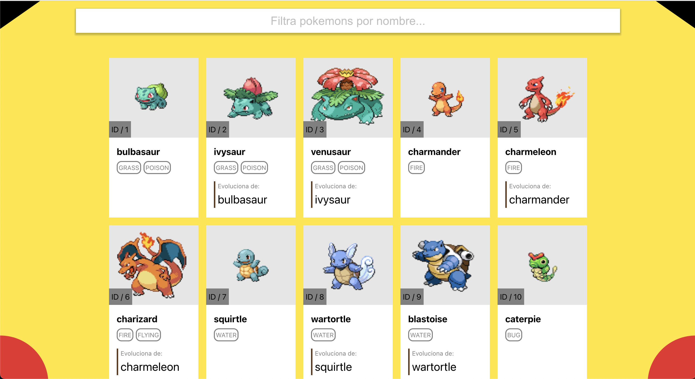

# Adalab Prueba Técnica Instructor FullStack

Buenos días,

En este repositorio, encontrarán los dos proyectos descritos en la especificación de la prueba técnica: el front-end y el back-end. Ambos han sido desarrollados utilizando las tecnologías especificadas e implementando principios de clean architecture, SOLID, entre otros.

Espero que el trabajo presentado sea de su agrado y estoy ansioso de recibir una respuesta. Me entusiasma la posibilidad de ejercer como docente y estoy disponible para discutir cualquier duda sobre el desarrollo del proyecto o para proporcionar justificaciones sobre las decisiones de implementación tomadas. Quedo a su disposición para cualquier debate que deseen tener al respecto.

Agradezco de antemano la oportunidad concedida y muchas gracias por todo.

<p align="center">
  
</p>

## Table of Contents

  - [Motivación](#motivación)
  - [Objetivos](#objetivos)
  - [Tecnologías Implementadas](#tecnologías-implementadas)
  - [Instalación](#instalación)
  - [Licencia](#licencia)

## Motivación

La vacante actual se alinea perfectamente con mis tecnologías favoritas en el mundo de la programación. Desde mis primeros pasos como programador, he cultivado una fuerte afinidad por trabajar con JavaScript y TypeScript, explorando todos sus matices para perfeccionar mis habilidades y convertirme en un desarrollador destacado.

Tras completar mis estudios, siempre he aspirado a orientar mi carrera profesional hacia la docencia en el ámbito de la programación. Mi deseo es compartir mi pasión por este oficio y contribuir al crecimiento y desarrollo de futuros profesionales en este fascinante campo.

## Objetivos

Se han mantenido constantemente en mente los objetivos del proyecto. Uno de los valores añadidos es la capacidad de utilizar este proyecto como un ejemplo práctico y material pedagógico para explicar cómo llevar a cabo una prueba técnica y desarrollarla siguiendo una gestión de ramas adecuada mediante el uso de Git y sus comandos en la consola. Esto incluye la implementación de una arquitectura de directorios eficiente y la aplicación de los principios SOLID, ampliamente reconocidos en entornos de programación.

El proyecto se ha diseñado exclusivamente utilizando las tecnologías mencionadas en la especificación de la prueba técnica, así como aquellas relacionadas, como React Router para React o Mongoose para MongoDB.

Se ha limitado el uso de tecnologías externas, como MaterialUI o Tailwind, ya que considero fundamental comprender primero cómo generar componentes altamente reutilizables, estructurarlos adecuadamente y crear clases de estilos genéricas. Esto se considera un paso esencial antes de adentrarse en el aprendizaje de bibliotecas mencionadas.

Al mismo tiempo, he decidido implementar una base de datos no relacional como MongoDB. Dado que mi actualmente trabajo con bases de datos relacionales, como PostgresQL y SQLServer, consideré que sería beneficioso incorporar MongoDB en este proyecto. Esta elección no solo me permite revitalizar conceptos fundamentales, sino que también aprovecho la conveniencia que ofrece MongoDB para la creación de bases de datos en uno de sus clusters de Mongo Atlas.

Ambos proyectos incluyen los archivos .env, los cuales deberían estar excluidos según las directrices del archivo .gitignore. No obstante, se ha tomado la decisión de dejarlos en el repositorio con el fin de facilitar la configuración y ejecución del proyecto sin complicaciones. Esto permite verificar que la operativa se ajusta correctamente a lo solicitado en la especificación.

Es importante destacar que en un entorno de producción, un repositorio nunca debería contener el archivo .env en seguimiento. Este archivo es especialmente delicado, ya que almacena información de alto valor y sensibilidad. La práctica estándar es evitar su inclusión en repositorios públicos o compartidos, preservando así la confidencialidad de la información contenida en él.

---

**[⬆ back to top](#table-of-contents)**

## Tecnologías Implementadas

### Lenguajes de programacón y de marcas utilizados

- TypeScript
- JavaScript
- HTML
- CSS
- SCSS

### Tecnologías implementadas en el Fron-End

- React
- React DOM
- React Router
- Node
- Vite
- Eslint

### Tecnologías implementadas en el Back-End

- Cookie Parse
- Dotenv
- Express
- Http errors
- Jade
- Morgan
- Mongoose
- Nodemon

---

**[⬆ back to top](#table-of-contents)**

## Instalación

1. Primero de todo deberemos clonarnos el repositorio mediante GitHub o el comando mostrado a continuación:

`$ git clone https://github.com/pau13-loop/pokemon-prueba-adalab.git`

### Front End

1. A continuación en el interior de directorio de cada proyecto procedemos a instalar las dependencias:

``` bash
$ cd front-end
$ npm i
```

2. Una vez instaladas las dependencias podemos proceder a ejecutar el proyecto

``` bash
$ npm run start
```

1. A continuación podemos dirigirnos al puerto en el cual se haya levantado el proyecto en nuestro servidor en local `localhost`

### Back End

1. A continuación en el interior de directorio de cada proyecto procedemos a instalar las dependencias:

``` bash
$ cd front-end
$ npm i
```
2. Una vez instaladas las dependencias podemos proceder a ejecutar el proyecto

``` bash
$ npm run start
```

1. A continuación podemos dirigirnos al puerto 3000 por defecto en el cual se ha levantado el proyecto en nuestro servidor en local `localhost:3000`

En nuestro navegador debemos introducir la siguiente url: `http://localhost:3000/`

4. Las rutas que proveé nuestro proyecto back-end son las siguientes, que podemos introducir en nuestro navegador o Postman para consumirlas y ver que nos deveulven:

``` txt
Home: http://localhost:3000/

Error: http://localhost:3000/asda

Listado pokemons: http://localhost:3000/pokemon

Detalle pokemon: http://localhost:3000/pokemon/bulbasaur

Especies pokemon: http://localhost:3000/pokemon/species/ivysaur

```

En el proyecto del Back End, también se proporciona un comando para ejecutar las migraciones que incluye el proyecto, permitiendo así poblar la base de datos.

``` bash
$ npm run migrate
```

En caso de que desee modificar la URI de Mongo Atlas para que apunte a su propio Cluster personal, simplemente debe editar los campos indicados a continuación.

``` .env
MONGO_ATLAS=mongodb+srv://<user>:<password>@adalab.xfge1ie.mongodb.net/<database-name>?retryWrites=true&w=majority
```

---

**[⬆ back to top](#table-of-contents)**

## Licencia

MIT License

Copyright (c) 2020 AntoniPizarro and Pau Llinàs

Permission is hereby granted, free of charge, to any person obtaining a copy
of this software and associated documentation files (the "Software"), to deal
in the Software without restriction, including without limitation the rights
to use, copy, modify, merge, publish, distribute, sublicense, and/or sell
copies of the Software, and to permit persons to whom the Software is
furnished to do so, subject to the following conditions:

The above copyright notice and this permission notice shall be included in all
copies or substantial portions of the Software.

THE SOFTWARE IS PROVIDED "AS IS", WITHOUT WARRANTY OF ANY KIND, EXPRESS OR
IMPLIED, INCLUDING BUT NOT LIMITED TO THE WARRANTIES OF MERCHANTABILITY,
FITNESS FOR A PARTICULAR PURPOSE AND NONINFRINGEMENT. IN NO EVENT SHALL THE
AUTHORS OR COPYRIGHT HOLDERS BE LIABLE FOR ANY CLAIM, DAMAGES OR OTHER
LIABILITY, WHETHER IN AN ACTION OF CONTRACT, TORT OR OTHERWISE, ARISING FROM,
OUT OF OR IN CONNECTION WITH THE SOFTWARE OR THE USE OR OTHER DEALINGS IN THE
SOFTWARE.

---

**[⬆ back to top](#table-of-contents)**